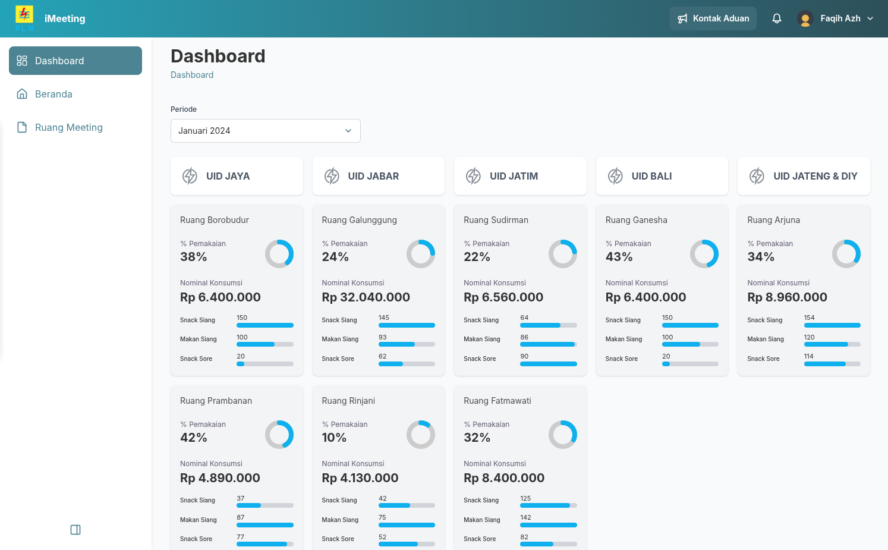
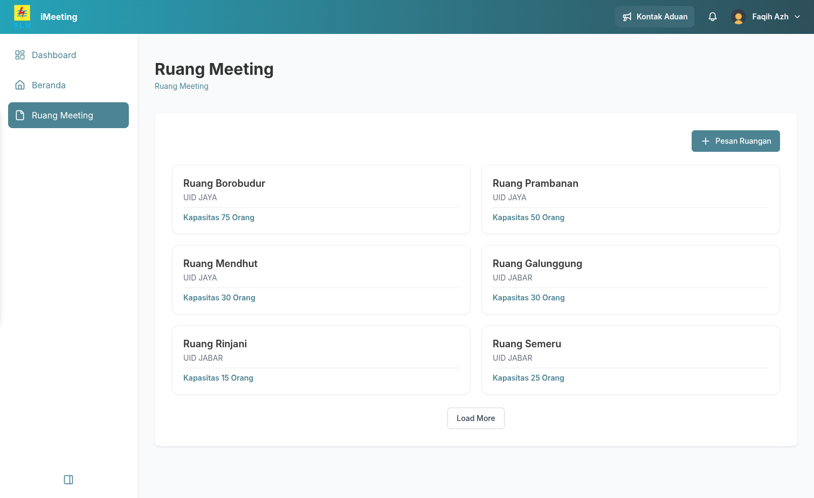
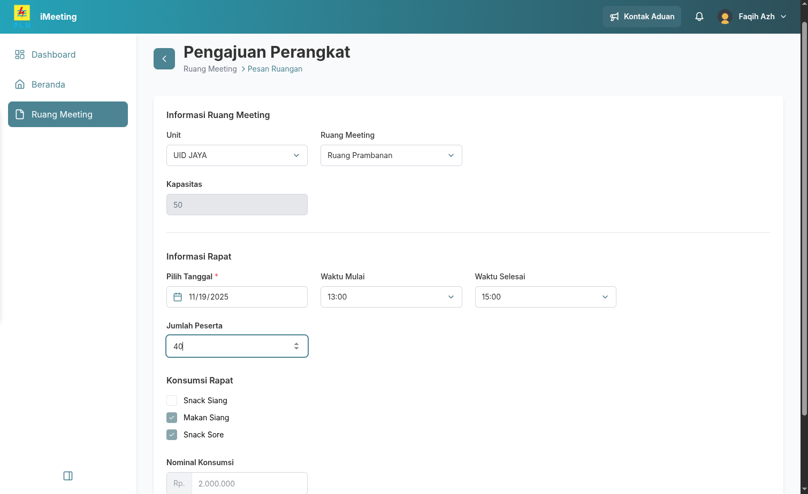
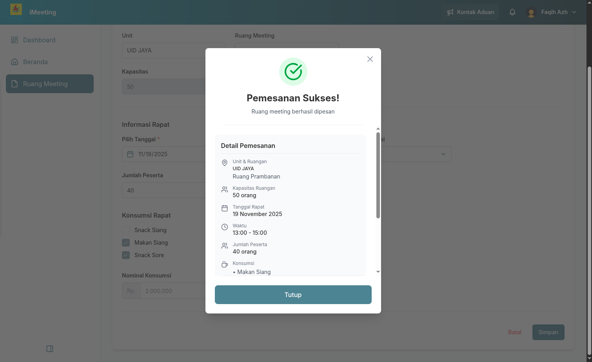
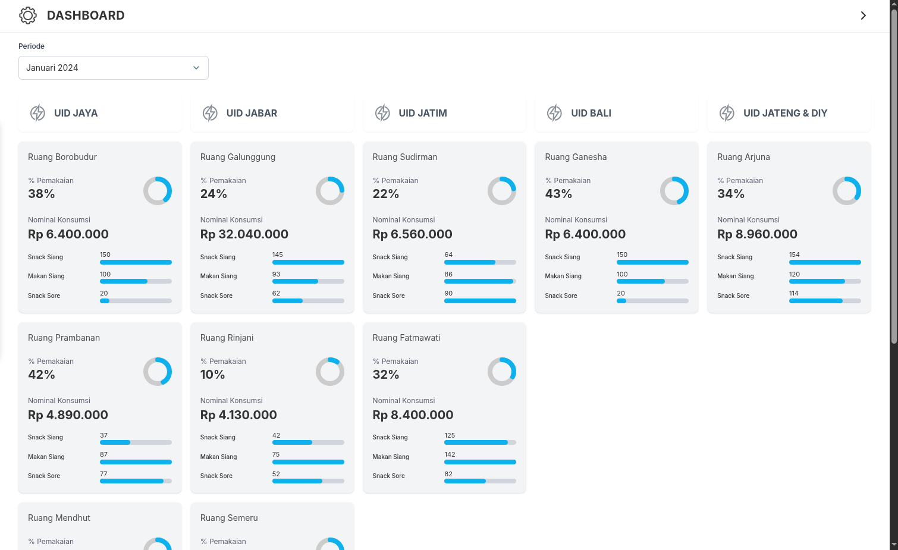
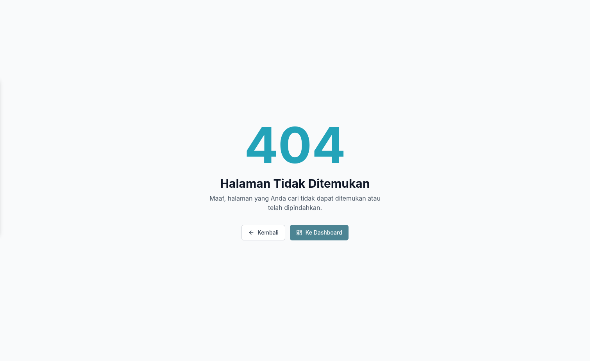

# Icon Frontend Test | iMeeting | Faqih Azhar

Aplikasi ini adalah proyek *frontend* yang dikembangkan menggunakan **React** dan **Vite** untuk simulasi sistem pemesanan ruang meeting dan dashboard monitoring penggunaan sumber daya (konsumsi) di lingkungan kantor.

## Fitur Utama

### Dashboard Monitoring
* Menampilkan ringkasan persentase penggunaan ruang meeting dan total **nominal konsumsi** per unit/ruangan.
* Data dapat difilter berdasarkan periode waktu (bulan/tahun).
* Visualisasi penggunaan dengan *progress bar*.

### Pemesanan Ruang Meeting
* Formulir mencakup Unit, Ruangan, Tanggal, Waktu Mulai/Selesai, dan Jumlah Peserta.
* **Validasi Kapasitas**: Memastikan jumlah peserta tidak melebihi kapasitas ruangan.
* **Kalkulasi Konsumsi Otomatis**: Secara otomatis memilih jenis konsumsi (`Snack Pagi`, `Makan Siang`, dll.) berdasarkan jam rapat yang dikonfigurasi dalam `TIME_BOUNDARIES`.
* **Kalkulasi Nominal**: Menghitung total biaya konsumsi.

### Halaman Ruang Meeting
* Menampilkan daftar ruangan sesuai data yang tersedia.

***

## Teknologi yang Digunakan

| Kategori | Teknologi | Versi |
| :--- | :--- | :--- |
| **Library** | **React** | `^19.2.0` |
| **Tooling** | **Vite** | `^7.2.2` |
| **Styling** | **Tailwind CSS**| `^4.1.17` |
| **Routing** | **React Router DOM** | `^7.9.6` |
| **HTTP Client** | **Axios** | `^1.13.2` |
| **Iocns** | **lucide-react** | `^0.554.0` |

***

## Instalasi

```bash
git clone https://github.com/FaqihAzh/icon-test-fe
cd icon-test-fe

npm install
# atau
yarn install
# atau
pnpm install

# .env
VITE_BASE_URL_PRIMARY=http://<URL_Primary_API>
VITE_BASE_URL_SECONDARY=http://<URL_Secondary_API>

npm run dev
```

## Screenshoot

#### Dashboard Layout


#### Daftar Meeting Room


#### Form Pemesanan Ruangan


#### Form Pemesanan Ruangan


#### Dashboard no Layout


#### 404 Not Found
